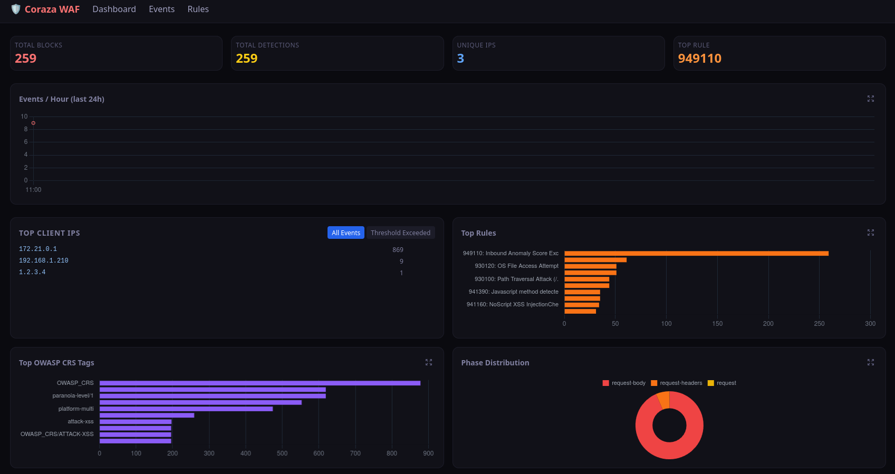
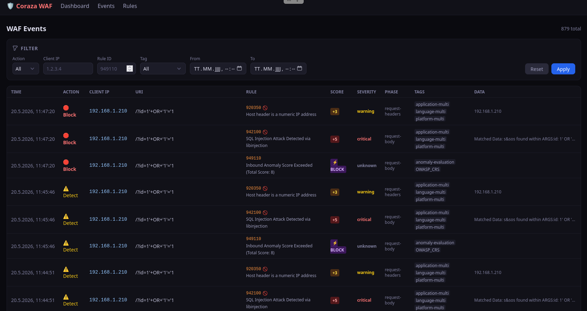
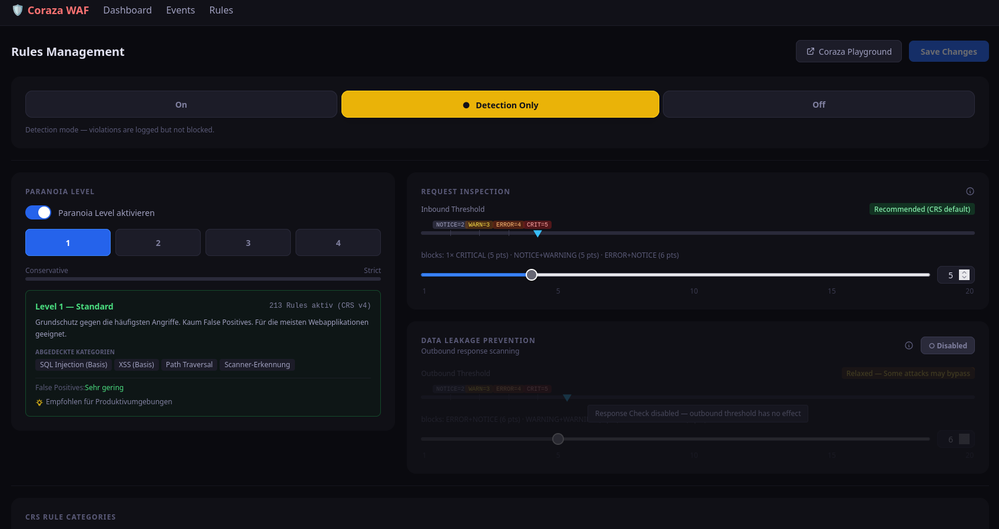

# coraza-dashboard

Logging & Monitoring Dashboard für **OWASP Coraza WAF** + **HAProxy**.

Zeigt Block-Events, Traffic-Statistiken und WAF-Aktivitäten in einem Dark-Theme Web-Dashboard — inklusive Live-Konfiguration der WAF-Regeln ohne Restart.

## Architektur

```
[Client]
   │
   ▼
[HAProxy :80]  ──── SPOE ────▶  [coraza-spoa :9000]
                                       │
                              JSON log lines (stdout)
                                       │
                               Docker fluentd log driver
                                       │
                                       ▼
                              [Fluent Bit :24224]
                              Filtert & forwardet WAF Events
                                       │
                               POST /api/ingest
                                       │
                                       ▼
                              [Backend :8080] (Go)
                              REST API + Ingest Handler
                                       │
                              [PostgreSQL :5432]
                                       │
                                       ▼
                              [Frontend :3000] (Vue 3)
```

## Services

| Service       | Port  | Beschreibung                                                |
|---------------|-------|-------------------------------------------------------------|
| `haproxy`     | 80    | Reverse Proxy mit Coraza SPOE-Filter                        |
| `haproxy`     | 8404  | HAProxy Stats-Seite (admin/changeme)                        |
| `coraza-spoa` | 9000  | OWASP Coraza WAF Agent (SPOE) — CRS v4.25.0                 |
| `fluentbit`   | 24224 | Log-Forwarder: empfängt coraza-spoa Logs, pushed an Backend |
| `backend`     | 8080  | Go REST API + Ingest Handler                                |
| `frontend`    | 3000  | Vue 3 Dashboard                                             |
| `httpbin`     | 8081  | Echo-Backend (für Tests)                                    |
| `postgres`    | 5432  | PostgreSQL Datenbank                                        |

## Quick Start

```bash
git clone https://github.com/StoveCode/coraza-dashboard.git
cd coraza-dashboard
sudo bash scripts/install.sh
```

Das war's. **Kein Build nötig** — alle Images kommen direkt von Docker Hub.

Das Install-Script erledigt automatisch:
- Docker + Docker Compose installieren (apt / dnf / pacman)
- `stove301/coraza-spoa:latest` von Docker Hub pullen
- `.env` aus `.env.example` anlegen
- Stack starten + Health-Check

### Manuell starten (ohne Install-Script)

```bash
git clone https://github.com/StoveCode/coraza-dashboard.git
cd coraza-dashboard
cp .env.example .env
docker compose up -d
```

Docker Compose zieht alle Images automatisch von Docker Hub — kein `docker build` erforderlich.

## Docker Hub Images

Alle Images sind öffentlich auf Docker Hub verfügbar:

| Image                                   | Beschreibung                                     |
|-----------------------------------------|--------------------------------------------------|
| `stove301/coraza-dashboard-backend`     | Go REST API + Ingest Handler                     |
| `stove301/coraza-dashboard-frontend`    | Vue 3 Dashboard                                  |
| `stove301/coraza-spoa`                  | OWASP Coraza WAF SPOE Agent (CRS v4.25.0)        |

**Tags:**
- `latest` — aktuell stabile Version
- `crs-v4.25.0` — coraza-spoa mit OWASP CRS v4.25.0

Lokales Bauen ist weiterhin möglich — `build:`-Direktiven sind in `docker-compose.yml` erhalten und werden via `docker compose build` genutzt.

## URLs

| URL                              | Beschreibung                   |
|----------------------------------|--------------------------------|
| http://localhost:3000            | WAF Dashboard                  |
| http://localhost:8080/api/health | Backend Health Check           |
| http://localhost:8080/api/stats  | Aggregierte Stats (JSON)       |
| http://localhost:8404/stats      | HAProxy Stats (admin/changeme) |
| http://localhost:8081            | httpbin Echo-Backend           |

## Traffic-Generator

Test-Script das zufälligen legitimen und bösartigen Traffic generiert:

```bash
# 1 Request alle 10 Sekunden, 100% Angriffe
python3 scripts/traffic-gen.py --rate 0.1 --ratio 1.0

# Optionen
python3 scripts/traffic-gen.py --help
#   --target  Ziel-URL (default: http://localhost:80)
#   --rate    Requests pro Sekunde (default: 1.0)
#   --ratio   Anteil Angriffs-Requests (default: 0.4)
```

Angriffsvektoren: SQLi, XSS, LFI, Path Traversal, RCE, SSRF, Scanner-UAs, Recon

## Screenshots

### Dashboard


### Events


### Rules Management


---

## Dashboard Features

### Charts (kompakt + expandierbar)
Alle Charts sind standardmäßig kompakt dargestellt. Per **⤢ Expand** Button öffnet sich ein Modal mit voller Größe.

| Chart               | Beschreibung                          |
|---------------------|---------------------------------------|
| Events / Hour       | Timeline der letzten 24h              |
| Top Client IPs      | Meist-angreifende IPs                 |
| Top Rules           | Häufigste ausgelöste WAF-Rules        |
| Top Tags            | CRS-Angriffskategorien (XSS, SQLi...) |
| Phase Distribution  | Wo in der Request-Phase geblockt wird |

### Rules Management (`/rules`)
Live-Konfiguration der WAF ohne Restart:

| Feature                  | Beschreibung                                                                                        |
|--------------------------|-----------------------------------------------------------------------------------------------------|
| **Engine Mode**          | `On` / `Detection Only` / `Off`                                                                     |
| **Paranoia Level**       | Level 1–4 (oder deaktiviert für manuelle Rule-Auswahl)                                              |
| **Anomaly Thresholds**   | Inbound (Request) + Outbound (Response) Score-Schwellwert                                           |
| **Response Check**       | Data Leakage Prevention ein/ausschalten                                                             |
| **CRS-Kategorien**       | SQLi, XSS, RCE, LFI, SSRF, Scanner etc. per Toggle                                                 |
| **Rule Picker**          | Einzelne CRS-Rules per Catalog-Suche deaktivieren (ID, Name, Tag, Severity)                         |
| **Orphaned Rules**       | Disabled Rules die nicht mehr im CRS existieren werden markiert und können entfernt werden          |
| **CRS Version**          | Aktuell geladene CRS-Version angezeigt, Mismatch-Warning wenn Dashboard ≠ coraza-spoa              |

Änderungen → **Save Changes** → Backend schreibt neues `coraza-spoa.yaml` → `docker compose restart coraza-spoa`

## API-Referenz (Backend)

| Method | Pfad                    | Beschreibung                                            |
|--------|-------------------------|---------------------------------------------------------|
| GET    | /api/health             | Health Check                                            |
| GET    | /api/events             | WAF-Events (paginated, filterbar)                       |
| GET    | /api/stats              | Aggregierte Statistiken                                 |
| GET    | /api/metrics            | Prometheus-Metriken (wenn CORAZA_METRICS_URL gesetzt)   |
| POST   | /api/ingest             | Log-Ingest Endpoint für Fluent Bit                      |
| GET    | /api/rules/config       | Aktuelle Rules-Konfiguration                            |
| PUT    | /api/rules/config       | Konfiguration speichern                                 |
| GET    | /api/rules/categories   | Liste der CRS-Kategorien                                |
| GET    | /api/rules/catalog      | Vollständiger CRS Rule-Catalog (ID, Name, Tag, Severity, PL) |
| GET    | /api/system/versions    | CRS-Versionen von Backend + coraza-spoa                 |

### GET /api/events Parameter

| Parameter    | Typ     | Beschreibung                        |
|--------------|---------|-------------------------------------|
| `limit`      | int     | Anzahl Einträge (default: 50)       |
| `offset`     | int     | Paginierung-Offset                  |
| `from`       | RFC3339 | Von-Zeitstempel                     |
| `to`         | RFC3339 | Bis-Zeitstempel                     |
| `disruptive` | bool    | true=Blocks, false=Detections       |
| `client_ip`  | string  | Filter nach Client-IP               |

### GET /api/stats Response

```json
{
  "total_blocks": 1234,
  "total_inbound_blocks": 1100,
  "total_outbound_blocks": 134,
  "total_detections": 56,
  "avg_anomaly_score": 7.3,
  "max_anomaly_score": 25,
  "score_distribution": [
    {"range": "0-5", "count": 120},
    {"range": "6-10", "count": 45}
  ],
  "top_ips": [{"label": "1.2.3.4", "count": 42}],
  "top_ips_blocked": [{"label": "1.2.3.4", "count": 38}],
  "top_rules": [{"rule_id": 941100, "msg": "XSS Attack...", "count": 30}],
  "top_tags": [{"label": "attack-xss", "count": 152}],
  "top_phases": [{"label": "request-body", "count": 535}],
  "events_per_hour": [{"hour": "2024-01-01T00:00:00Z", "count": 10}]
}
```

## Konfiguration (.env)

```env
# PostgreSQL
DB_NAME=coraza_dashboard
DB_USER=coraza
DB_PASSWORD=changeme

# Ports
HAPROXY_PORT=80
HAPROXY_STATS_PORT=8404
CORAZA_SPOE_PORT=9000
BACKEND_PORT=8080
FRONTEND_PORT=3000

# Backend
CORS_ALLOWED_ORIGINS=http://localhost:3000
LOG_LEVEL=info

# Log-Ingest via Fluent Bit (kein file tailer)
LOG_INGEST_MODE=true

# Optional: Prometheus-Scraping von coraza-spoa
# CORAZA_METRICS_URL=http://coraza-spoa:9090/metrics
```

## Log-Pipeline

coraza-spoa schreibt **zerolog JSON Lines** auf **stdout**. Fluent Bit empfängt die Logs via Docker `fluentd` log driver, filtert auf WAF-Events (Zeilen mit `"match"` Feld) und pushed sie per HTTP an `/api/ingest`.

```json
{
  "level": "error",
  "match": {
    "client": "1.2.3.4",
    "rule_id": 941100,
    "msg": "XSS Attack Detected via libinjection",
    "severity": "CRITICAL",
    "disruptive": false,
    "uri": "/search?q=<script>alert(1)</script>",
    "phase": "request-body",
    "tags": ["attack-xss", "OWASP_CRS"]
  },
  "time": "2024-01-01T00:00:00Z"
}
```

`disruptive: true` = Block, `disruptive: false` = Detection (SecRuleEngine DetectionOnly)

## OWASP CRS v4

coraza-spoa lädt automatisch das **OWASP Core Rule Set v4** (aktuell: **v4.25.0**). Konfiguration in `services/coraza/coraza-spoa.yaml`.

### Paranoia Level

```yaml
directives: |
  Include @coraza.conf-recommended
  Include @crs-setup.conf.example

  # PL2 aktivieren (Standard: 1)
  SecAction "id:900000,phase:1,nolog,pass,t:none,setvar:tx.blocking_paranoia_level=2"

  Include @owasp_crs/*.conf
  SecRuleEngine On
```

### Anomaly Score Threshold

```yaml
directives: |
  Include @coraza.conf-recommended
  Include @crs-setup.conf.example

  # Toleranter: höherer Threshold
  SecAction "id:900110,phase:1,nolog,pass,t:none,\
    setvar:tx.inbound_anomaly_score_threshold=10,\
    setvar:tx.outbound_anomaly_score_threshold=10"

  Include @owasp_crs/*.conf
  SecRuleEngine On
```

### Rules deaktivieren

```yaml
directives: |
  Include @coraza.conf-recommended
  Include @crs-setup.conf.example
  Include @owasp_crs/*.conf
  SecRuleEngine On

  SecRuleRemoveById 920350
  SecRuleRemoveByTag "attack-sqli"
```

### Änderungen anwenden

```bash
docker compose restart coraza-spoa
docker compose logs -f coraza-spoa
```

## CRS Update-Prozess

Das Dashboard zeigt eine **Mismatch-Warning** wenn die CRS-Version im Backend von der im coraza-spoa abweicht.

Update-Prozess:
1. Neues `stove301/coraza-spoa:crs-vX.Y.Z` Image erscheint auf Docker Hub
2. `docker compose pull && docker compose up -d`
3. Dashboard-Mismatch-Warning verschwindet automatisch

## Bekannte Einschränkungen

- **Rules Management Reload**: `PUT /api/rules/config` schreibt die neue Config, erfordert aber manuell `docker compose restart coraza-spoa` (coraza-spoa `-autoreload` nutzt fsnotify, was auf Hosts mit vielen inotify-Instanzen fehlschlägt).

## Host-Anforderungen

Auf Hosts mit vielen laufenden Prozessen (k8s, viele Container) ggf. inotify-Limit erhöhen:

```bash
echo "fs.inotify.max_user_instances=512" >> /etc/sysctl.conf
sysctl -p
```

## Projektstruktur

```
coraza-dashboard/
  docker-compose.yml         — Alle Services
  .env.example               — Konfigurationsvorlage
  scripts/
    install.sh               — Vollständiges Install-Script
    traffic-gen.py           — Traffic-Generator für Tests
  services/
    backend/                 — Go REST API + Ingest Handler
    frontend/                — Vue 3 Dashboard (Vite + Tailwind)
    fluentbit/               — Fluent Bit Config (Log-Forwarder)
    haproxy/                 — HAProxy + SPOE Config
    coraza/                  — coraza-spoa Config (OWASP CRS v4)
  agents/                    — Subagent Task-Dateien (Build-History)
```
